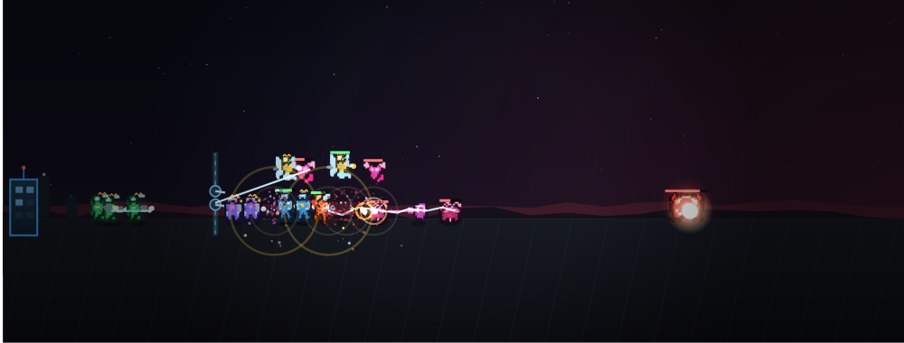
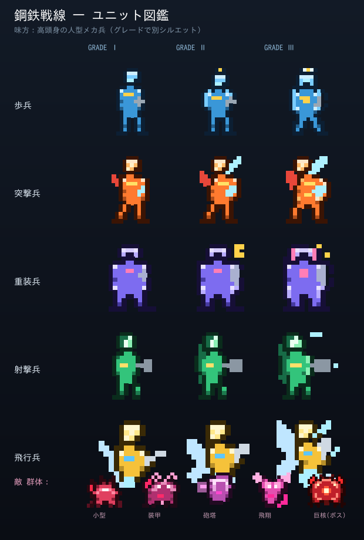
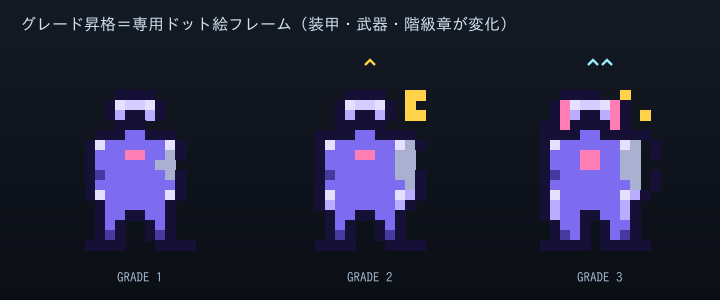
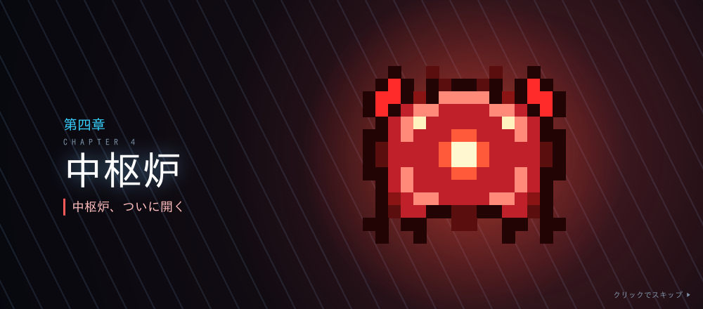
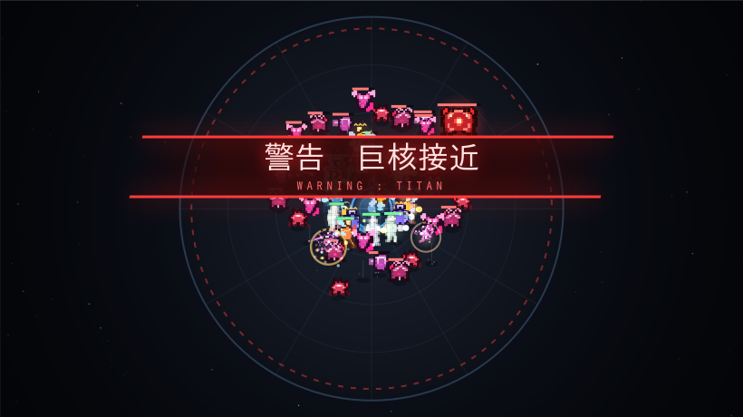

# 鋼鉄戦線 — Steel Front

工業力で量産ロボットを生み出し、物量で押し寄せる機械生命体「群体（スウォーム）」の侵攻を防ぐ、
シナリオ付きのブラウザ防衛ストラテジー。ビルド不要・依存なしの素のHTML/CSS/JSで動きます。



## ビジュアル / 演出

Canvas による自前の描画エンジンで、戦場が常に動く。外部画像アセットは一切使わず、
キャラクターはコード内の**ドット絵（ピクセルグリッド）**として定義している（`js/sprites.js`）。



- **ドット絵キャラクター** … 味方は**頭身高めのスマートな人型メカ兵**としてシェーディング付きで作画
  （歩兵・突撃兵・重装兵・射撃兵・飛行兵）。歩行で脚が振れ、空中機は推進炎をなびかせる。
  敵「群体」は**禍々しいクリーチャー**（小型蟲・甲殻獣・砲口蟲・膜翼竜・多眼の巨核ボス）として描き分け。
- **グレードごとに専用ドット絵フレーム** … ボディ／ウェポンのグレードが上がると、機体そのものが
  **別シルエットのフレームに差し替わる**（Ⅰ標準→Ⅱ強化→Ⅲ精鋭：装甲増加・武器大型化・意匠追加）。
  加えて**階級章（シェブロン）** と武装種を示すマズル発光・発光オーラが付与される。
- **撃破時のドット破片飛散** … ユニット／敵は撃破されると、自身を構成するドットがそのままの色で
  弾け飛んで落下する。
- **多層背景** … 空のグラデーション、敵側の赤いグロー、ドリフトする星、遠近の稜線、
  奥行きを出す地面グリッド、基地シルエット、ビネット。
- **戦闘エフェクト** … 銃口フラッシュ、弾道トレーサー、砲台ビーム、**拡散兵装のAoEリング**、
  **連鎖兵装のライトニング**、爆発・パーティクル、生産時のスポーン演出。
- **カットイン演出** … 波の開始（WAVE）／殲滅（CLEAR）／**ボス出現の警告**がネオンの帯でスライドイン。
  さらに**章開始はフルスクリーンの立ち絵カットイン**（章番号・タイトル・脅威キャラの大判ドット絵）。
- **手応えの演出** … ボス撃破・司令部被弾で**画面シェイク**と赤フラッシュ。
- UI も発光・トランジション・モーダルのフェードイン等で質感を統一（`prefers-reduced-motion` 対応）。







## 遊び方

`game/index.html` をブラウザで開くだけ。（ローカルサーバ不要。ダブルクリックでも動作します）

### 基本ループ
1. **基盤を整える** … 発電所で電力、採掘機で鉱石、研究所で研究ポイントを供給する。
2. **部品工場を建てる** … ボディ工場・ヘッド工場・ウェポン工場が、準備中も稼働して**部品を在庫に備蓄**する。
3. **組立ラインに設計を組む** … 「ボディ＋ウェポン＋ヘッドCPU」を設定。**戦闘中**に在庫を消費して機体を連続生産する。
4. **「次の波を呼ぶ」** … 出撃すると組立ラインが稼働。生まれた機体は自動で前線に進軍し、群体を迎撃する。
5. **研究で拡張** … 兵科（ボディ）・CPU・ウェポン・各グレードを解放し、設計の幅を広げる。
6. **章を勝ち抜く** … 章クリアごとにシナリオが進み、恒久ボーナスを選ぶ決断を迫られる。

> 準備フェーズに時間制限はありません。部品を備蓄し、設計を練ってから出撃するのが安全策。

## 工業（供給チェーン）

ユニットは3つの部品を**組み合わせて**作られる。各部品は研究で解放・強化される。

| 部品 | 意味 | 役割 |
|------|------|------|
| **ボディ** | 兵科 | そのユニットの種類を決める。研究で兵科を解放、グレードで全ステータスが上昇 |
| **ヘッド** | 拡張スキル | グレード（1〜）ぶんの **CPUスロット**を持つ。CPUを挿して能力を強化 |
| **ウェポン** | 武器性能 | ライン毎に選択。グレードで火力上昇／範囲化／連鎖化など攻撃が変化（全兵科に装着可） |

- **部品工場**は在庫上限まで部品を生産し、満杯になると停止（鉱石の無駄を防ぐ）。
- **組立ライン**は設計どおりにボディ＋ヘッド＋ウェポンを1つずつ消費して機体を生産。
  対応する部品工場が無いラインは「⚠ 未供給」となり生産できない――**供給を設計に合わせる**のが工業の肝。
- ライン数・工場数・採掘量・電力のバランスが、戦闘中の**増援が湧き続ける速度**を決める。

**CPU例**: 装甲(防御+)・出力(攻撃+)・増装(HP+)・加速(速度+)・照準(射程+)・連射(攻撃速度+)。
**ウェポン例**: 標準(単体)・拡散(範囲)・連鎖(敵から敵へ跳ねる)・重兵装(単体高火力)。

## 絡み合うシステム（奥深さの源）

- **電力（フロー資源）** … 供給より消費が大きいと全生産効率が低下。発電と拡張のバランスが要。
- **指揮容量** … 同時展開できるユニット総量の上限。通信中継塔や研究で拡張。
- **地上／空中ドメイン** … 空中ユニットは「対空」を持つ相手にしか攻撃されない。
  空の敵には対空（射撃兵・飛行兵・防衛砲台）が無いと一方的に基地を喰われる。
- **装甲（防御力）** … ダメージ = max(1, 攻撃力 − 防御力)。低火力の物量（歩兵）は装甲持ちに刺さらず、
  高火力（突撃兵・射撃兵）が装甲を割る。編成の噛み合いが勝敗を分ける。
- **研究ツリーの分岐** … 工業／機体／武装／CPU／特殊の系統。どこに伸ばすかで設計の方向が変わる。
- **シナリオの選択** … 章の合間の決断が、生産・火力・装甲などの恒久ボーナスとして残り続ける。

## 兵科（ボディ）

| 兵科 | 領域 | 特徴・役割 |
|----------|------|-----------|
| 🪖 歩兵 | 地上 | 最もスタンダードで安価。量産して物量を担保する主力 |
| ⚡ 突撃兵 | 地上 | 火力・機動力が高く脆い。敵陣を突破して活路を開く |
| 🛡 重装兵 | 地上 | 体力・防御力が高く鈍重。前線を支える鉄壁の防衛線 |
| 🎯 射撃兵 | 地上 | 後方から高火力で狙撃。**対空可**で安定して敵戦力を削る |
| 🚁 飛行兵 | 空中 | 空から地上・空中を射撃。地上敵に阻まれず敵陣の奥へ進む（**対空可**） |

歩兵・突撃兵は最初から、重装兵・射撃兵・飛行兵は研究で解放する。
敵にも装甲型・砲塔型・飛翔型・巨核（ボス）がおり、相手に合わせた設計が必要になる。

## ファイル構成

```
game/
├─ index.html        画面構造（設備／部品工場／組立／研究タブ）
├─ css/style.css     スタイル（SFダークトーン）
└─ js/
   ├─ data.js        設備・部品(ボディ/CPU/ウェポン)・敵・研究・シナリオの全データ（調整はここ）
   ├─ sprites.js     ドット絵スプライト定義（兵科・敵キャラの文字グリッド）
   ├─ game.js        状態・経済・供給チェーン生産・自動戦闘・波・研究のコアロジック
   └─ ui.js          描画（Canvas）・工業UI・カットイン・エフェクト・メインループ
```

数値バランスはすべて `data.js` に集約しているので、調整や拡張が容易です。

## シナリオ（あらすじ）

辺境採掘基地カストルの通信途絶から72時間。目覚めた指揮AI〈あなた〉は、
自己増殖する機械の群れと対峙する。その正体は、旧文明が遺した暴走する無人兵器工場だった——。
全4章。地下の中枢炉を巡る最終防衛戦の先に、次なる戦線の予兆が待つ。
