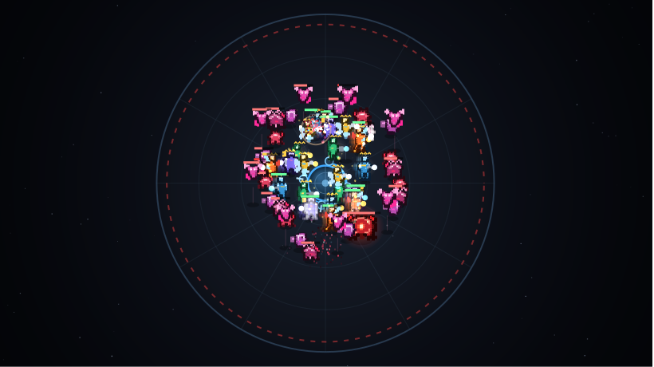

# 鋼鉄戦線 — Steel Front

工業力で量産ロボットを生み出し、**360度全方位**から殺到する機生兵「イーヴィル」の侵攻を
研究基地オールトのドーム自陣で防ぐ、シナリオ付きのブラウザ防衛ストラテジー。**物量 VS 物量**のアリーナ戦。
ビルド不要・依存なしの素のHTML/CSS/JSで動きます。



## ビジュアル / 演出

Canvas による自前の描画エンジンで、戦場が常に動く。外部画像アセットは一切使わず、
キャラクターはコード内の**ドット絵（ピクセルグリッド）**として定義している（`js/sprites.js`）。


- **ドット絵キャラクター** … 味方は**頭身高めのスマートな人型メカ兵**としてシェーディング付きで作画
  （歩兵・突撃兵・重装兵・射撃兵・飛行兵）。歩行で脚が振れ、空中機は推進炎をなびかせる。
  敵「イーヴィル」は**禍々しいクリーチャー**（小型蟲・甲殻獣・砲口蟲・膜翼竜・多眼の巨核ボス）として描き分け。
- **グレードごとに専用ドット絵フレーム** … ボディ／ウェポンのグレードが上がると、機体そのものが
  **別シルエットのフレームに差し替わる**（Ⅰ標準→Ⅱ強化→Ⅲ精鋭：装甲増加・武器大型化・意匠追加）。
  加えて**階級章（シェブロン）** と武装種を示すマズル発光・発光オーラが付与される。
- **モーション** … 兵科ごとに固有の待機ゆれ（突撃兵は軽快／重装兵はどっしり等）、
  攻撃時は**近接=踏み込み・遠隔=反動**のアクション、被弾した敵は**のけ反り＋白フラッシュ**でひるむ。
- **グレードⅢ精鋭エフェクト** … 最上位フレームの機体は移動時に**残像**を引き、**オーラ粒子**を立ち上らせる。
- **撃破時のドット破片飛散** … ユニット／敵は撃破されると、自身を構成するドットがそのままの色で
  弾け飛んで落下する。
- **360度アリーナ** … 中央の**ドーム自陣**を中心に、放射状グリッドの円形戦場。外周の赤い危険帯から
  **全方位に敵が出現**して殺到し、味方は四方へ展開して迎撃する（トップダウン視点・ビルボード描画）。
  ドームはHPリングで残量を表示し、砲台は周囲を旋回。宙の星とビネットで奥行きを演出。
- **戦闘エフェクト** … 銃口フラッシュ、弾道トレーサー、砲台ビーム、**拡散兵装のAoEリング**、
  **連鎖兵装のライトニング**、爆発・パーティクル、生産時のスポーン演出。
- **カットイン演出** … 波の開始（WAVE）／殲滅（CLEAR）／**ボス出現の警告**がネオンの帯でスライドイン。
  さらに**章開始はフルスクリーンの立ち絵カットイン**（章番号・タイトル・脅威キャラの大判ドット絵）。
- **手応えの演出** … ボス撃破・司令部被弾で**画面シェイク**と赤フラッシュ。
- UI も発光・トランジション・モーダルのフェードイン等で質感を統一（`prefers-reduced-motion` 対応）。


## 遊び方

`game/index.html` をブラウザで開くだけ。（ローカルサーバ不要。ダブルクリックでも動作します）

### 基本ループ
1. **鉱区で採取** … 鉱区Ⅰ〜Ⅵに**採取モジュール**を投入し、鉄・銅・銀・金・プラチナ・ダイヤを掘る。
2. **生産ラインを敷く** … 「生産ライン」タブの盤面に設備をタイル配置し、**コンベア(⇢)で繋ぐ**。
   **資源入力→製錬炉(素材→合金)→部品工場(合金→ボディ/ヘッド/ウェポン)→組立機**とアイテムが流れる。
3. **組立機に設計を組む** … 組立機を選んで「ボディ＋ウェポン＋ヘッドCPU」を設定。3部品が揃うと機体を生産。
4. **発電・電力** … 発電機が電力を供給。消費が上回ると全設備の稼働が遅くなる。研究所/通信塔/砲台も盤面に配置。
5. **「次の波を呼ぶ」** … イーヴィルが**360度全方位**から中央のドーム自陣へ殺到。生まれた機体は自動で迎撃に向かう。
6. **研究／ストーリーで拡張** … 兵科・CPU・ウェポン・各グレードを研究で解放。鉱区とモジュールは章進行で拡張。

> 準備フェーズに時間制限はありません。ラインを敷き、設計を練ってから出撃するのが安全策。
> 配置＝クリック、コンベアは**ドラッグで方向を引く**、向きは「回転」で変更、不要なら「撤去」。

### 暫時防衛（周回コンテンツ）

各章をクリアするごとに、いつでも出撃できる防衛ステージ「**暫時防衛**」が解放される
（第N章クリアで ステージN）。準備フェーズの「🛡 暫時防衛」から、解放済みのステージを選んで出撃。
**勝利すると確率で「資源供給モジュール」を獲得**でき、上位ステージほど難易度と獲得数が上がる。
獲得したモジュールは保有上限ごと永続的に増えるため、資源産出を伸ばす周回育成になる。
本陣HPは戦闘後に回復する（campaignを終わらせない）が、戦闘で失った機体は戻らない。

## 工業（グリッド・ファクトリー）

設備をタイル盤面に**自分で配置**し、**コンベアで繋いで**アイテムを流す簡易ファクトリー。
ユニットは **素材 → 合金 → 3パーツ → 組立** という流れで作られ、繋がっていないラインは止まる。

- **鉱区（Ⅰ〜Ⅵ）＝素材（鉄→銅→銀→金→プラチナ→ダイヤ）＝グレード（1〜6）** …
  ストーリー進行で鉱区が順に解放され、対応素材の鉱区を解くと**規格（グレード）研究**が可能になる
  （鉱区Ⅱ＝銅でグレード2…鉱区Ⅵ＝ダイヤでグレード6）。グレードは研究で全機体に反映。
- **設備（盤面に配置）** … 資源入力（鉱区の素材を取り込む）／製錬炉（素材ペア→中間素材）／部品工場（中間素材→ボディ/ヘッド/ウェポン）
  ／組立機（3部品→機体）／コンベア／発電機／研究所／通信中継塔／モジュール工房／防衛砲台。建設コストは**鉄**。
- **製錬レシピ＝グレード帯** … 製錬炉のレシピは段階制。
  **鋼材(鉄×2/G1) → 合金(鉄+銅/G2) → 銀回路(銅+銀/G3) → 金回路(銀+金/G4) → 輝素核(金+白金/G5) → 動力核(白金+ダイヤ/G6)**。
  部品工場は**現在の規格（グレード）が要求する中間素材**を消費するため、規格を研究して上げたら製錬炉のレシピと素材供給を**敷き直す**必要がある（＝全素材・全レシピが順に必要になる）。
- **コンベア** … ドラッグで敷設し、流れる向きを引く。機械の出力側（矢印）から下流へアイテムが運ばれる。繋がっていないラインは止まる。
- **電力** … 発電機が供給、各設備が消費。供給を超えると全設備の稼働速度が低下する。
- **研究で解放される設備** … 通信中継塔（指揮容量）＝指揮系統拡張／モジュール工房＝採取拡張Ⅰ／防衛砲台＝防衛砲台開発。
- **組立機の設計** … 組立機を選んで「ボディ＋ウェポン＋ヘッドCPU」を設定。指揮容量の範囲で機体を連続生産する。

ラインの引き回し、製錬レシピの切り替え、各工程の台数バランス、電力――これらが戦闘中の**増援が湧き続ける速度**を決める。

**CPU（ヘッドに装着する拡張）**:
- 基本強化 … 装甲(防御+)・出力(攻撃+)・増装(HP+)・加速(速度+)・照準(射程+)・連射(攻撃速度+)・反応装甲(防御+HP)
- 戦術CPU … 対空(空中目標を攻撃可)・貫通(防御無視)・暴撃(確率2倍)・吸命(与ダメで回復)・修復(毎秒HP回復)
- 状態異常・特殊 … 鈍化(敵を減速)・麻痺(確率で行動不能)・遮蔽(再生シールド)・反射(被弾を反射)・多重(近接敵を追撃)

ヘッド規格でスロット数(1→3)が増え、複数CPUを組み合わせて機体を特化できる。
**ウェポン例**: 標準(単体)・拡散(範囲)・連鎖(敵から敵へ跳ねる)・重兵装(単体高火力)。

## 絡み合うシステム（奥深さの源）

- **電力（フロー資源）** … 供給より消費が大きいと全生産効率が低下。発電と拡張のバランスが要。
- **指揮容量** … 同時展開できるユニット総量の上限。通信中継塔や研究で拡張。
- **地上／空中ドメイン** … 空中ユニットは「対空」を持つ相手にしか攻撃されない。
  空の敵には対空（射撃兵・飛行兵・防衛砲台）が無いと一方的に基地を喰われる。
- **装甲（防御力）** … ダメージ = max(1, 攻撃力 − 防御力)。低火力の物量（歩兵）は装甲持ちに刺さらず、
  高火力（突撃兵・射撃兵）が装甲を割る。編成の噛み合いが勝敗を分ける。
- **研究ツリーの分岐** … 工業／機体／武装／CPU／特殊の系統。どこに伸ばすかで設計の方向が変わる。
- **シナリオの選択** … 章の合間の決断が、生産・火力・装甲などの恒久ボーナスとして残り続ける。

## 兵科（ボディ）

| 兵科 | 領域 | 特徴・役割 |
|----------|------|-----------|
| 🪖 歩兵 | 地上 | 最もスタンダードで安価。量産して物量を担保する主力 |
| ⚡ 突撃兵 | 地上 | 火力・機動力が高く脆い。敵陣を突破して活路を開く |
| 🛡 重装兵 | 地上 | 体力・防御力が高く鈍重。前線を支える鉄壁の防衛線 |
| 🎯 射撃兵 | 地上 | 後方から高火力で狙撃。**対空可**で安定して敵戦力を削る |
| 🚁 飛行兵 | 空中 | 空から地上・空中を射撃。地上敵に阻まれず敵陣の奥へ進む（**対空可**） |

歩兵・突撃兵は最初から、重装兵・射撃兵・飛行兵は研究で解放する。
敵にも装甲型・砲塔型・飛翔型・巨核（ボス）がおり、相手に合わせた設計が必要になる。

## ファイル構成

```
game/
├─ index.html        画面構造（設備／部品工場／組立／研究タブ）
├─ css/style.css     スタイル（SFダークトーン）
└─ js/
   ├─ data.js        設備・部品(ボディ/CPU/ウェポン)・敵・研究・シナリオの全データ（調整はここ）
   ├─ sprites.js     ドット絵スプライト定義（兵科・敵キャラの文字グリッド）
   ├─ factory.js     生産ライン（グリッド・ファクトリー）の設備定義・配置・フロー シミュレーション
   ├─ game.js        状態・経済・自動戦闘・波・研究のコアロジック（生産は factory.js を駆動）
   └─ ui.js          描画（Canvas）・生産ライン盤面UI・カットイン・エフェクト・メインループ
```

数値バランスはすべて `data.js` に集約しているので、調整や拡張が容易です。

## シナリオ（あらすじ）

荒野に建つ人類文明の最前線、研究基地【オールト】。その新たな管理者として赴任した〈あなた〉は、
基地を全周から襲う謎の機械生命体「イーヴィル」と、相棒のサポートAI〈ケイオス〉と共に対峙する。
やがて明かされるのは、イーヴィルの正体――旧文明が遺した自己増殖兵器「機生兵」の成れの果て。
量産ラインでオールトを守り抜き、そして再建せよ。

各章の開幕・終幕は **VN（ビジュアルノベル）風の会話劇**で再生される（立ち絵＋名前＋台詞、
表情・立ち位置・画面演出つき）。立ち絵PNGは `game/portraits/` に置いて差し替え可能で、
未配置の間は自動でプレースホルダ表示になる。台本・キャラ・演出の書き方は
**[`STORY.md`](STORY.md)** に集約。シナリオはこの形式へ流し込むだけで追加できる。
